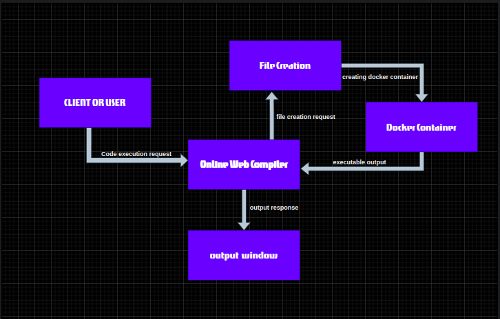
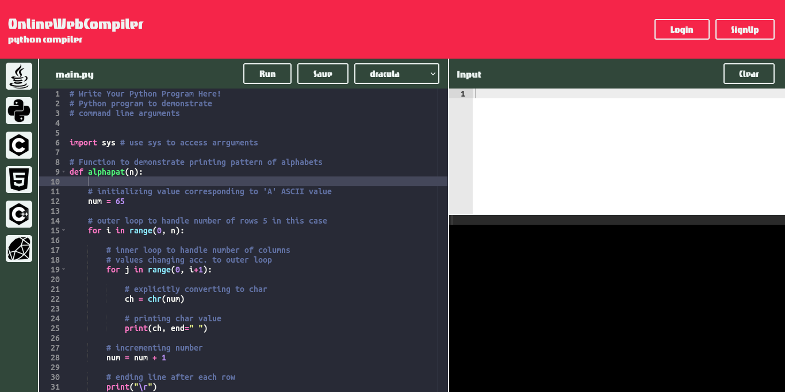
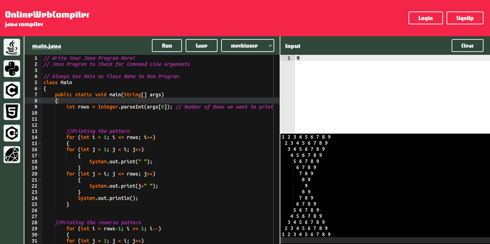
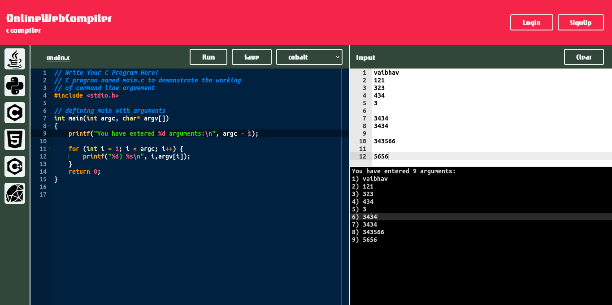
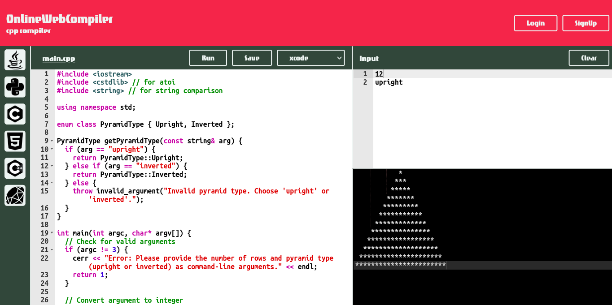
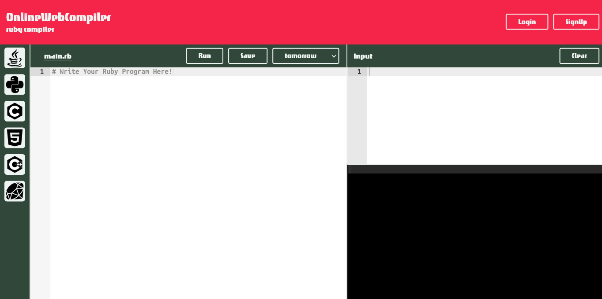
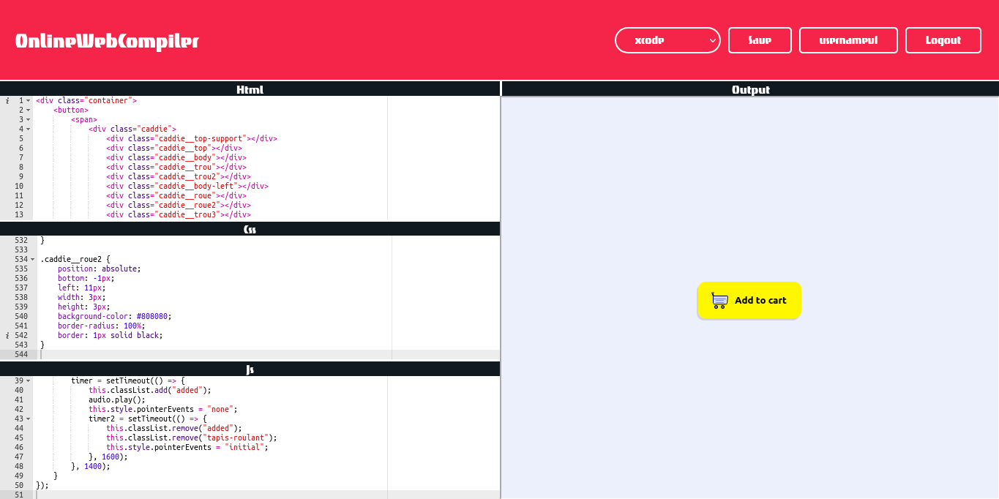

## Key Feature of **Online Web Compiler**

- **Multi-Language support**
- **Syntax Highlighting**
- **Real-Time Error Detection**
- **Output Display**
- **Save and Load Projects**
- **Responsive Design**

## Technologies Used

- **FrontEnd**
  - **HTML, CSS & JAVASCRIPT**
- **ace Editor**
- **BackEnd**
  - **Nodejs**
  - **Express.js**
  - **Docker**
  - **mongodb**

## Project Architecture

## Snapshot of Project

